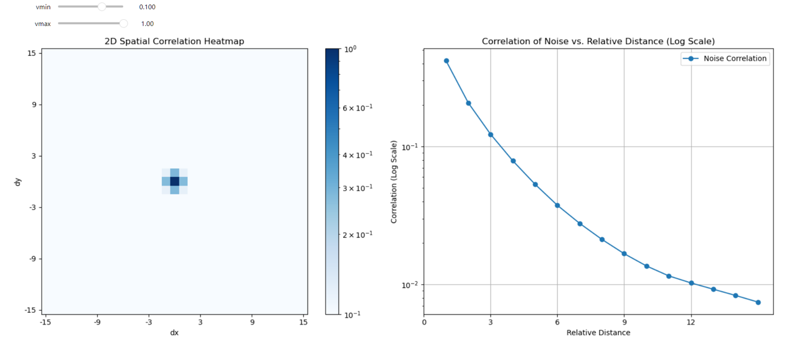

# Self-supervised machine-learning framework for high-throughput electron microscopy
Joodeok Kim (juori22@snu.ac.kr)¹†, Jinho Rhee (jhrhee01@snu.ac.kr)¹†, Sungsu Kang¹, Mingyu Jung¹, Jihoon Kim¹, Miji Jeon¹, Junsun Park¹, Jimin Ham², Byung Hyo Kim³, Won Chul Lee (wonchullee@hanyang.ac.kr)²*, Soung-Hun Roh (shroh@snu.ac.kr)¹*, Jungwon Park (jungwonpark@snu.ac.kr)¹*

¹Seoul National University, Seoul, Republic of Korea \
²Hanyang University, Ansan, Gyeonggi, Republic of Korea \
³Soongsil University, Seoul, Republic of Korea 

†These authors contributed equally.\
\*Corresponding authors

This is the code for our paper, "Self-supervised machine-learning framework for high-throughput electron microscopy". Our method includes denoising of liquid cell TEM, in-situ (S)TEM, and cryo-ET micrographs.

Datasets for our paper are available on Zenodo at https://zenodo.org/records/14922032.

## Installation
We recommend using a virtual environment for both training and inference.

<pre>
<code>(base) conda create -n TEM_denoiser python=3.11
(base) conda activate TEM_denoiser
(TEM_denoiser) conda install pytorch::pytorch torchvision torchaudio pytorch-lightning opencv mrcfile ncempy tensorboard matplotlib numba -c pytorch -c conda-forge
</code>
</pre>
The code has been tested on Windows 11 with WSL2 (RTX 2080Ti with CUDA), Ubuntu 20.04 (RTX 3090 with CUDA), Ubuntu 22.04 (RTX A6000 with CUDA), and MacOS (M1 Pro with MPS).

## Tutorial

### 1. Noise Statistics Estimation (Blind-spot Size Determination)
We provide `Noise_Statistics.ipynb` to estimate the noise statistics of images and determine the blind-spot size based on spatial correlation.

1. Write the path of an image from the dataset that you want to denoise. Use any representative image for the estimation: <pre>
<code>image = cv.imread("./Datasets/Au/Tif_convert0081.tif", cv.IMREAD_UNCHANGED)
</code></pre>
2. Run the subsequent cells in the notebook. The results will display the estimated noise statistics, as shown below:

Spatial correlation heatmap suggests that using a 3x3 blind-spot size would be suitable for effictive denoising.

### 2. Training & Inference
Run the following commands in the terminal with the parameters described below, or create a shell script for convenience.
### Parameters:
* `common_path`: Path to result folder where outputs will be saved.
* `training_path`: Path to the training dataset.
* `gt_path`: Path to the ground truth dataset, if available.
* `data_path_test`: Path to the dataset for inference.
* `save_folder_name`: Name of the folder where results will be saved (e.g, `experiment`).
* `version_folder_name`: Version name of the current experiment (e.g., `3x3_blind_spot`).
* `model`: Blind-spot size of the network (e.g., `3x3_blind`, `1x1_blind`).
* `img_size`: Size of the cropped images used during training (e.g., `256` for 256x256 images).
* `batch_size`: Batch size (default: `32`).
* `max_epochs`: Total number of training epochs (default: `200`).
* `recursive_factor`: Using multiplier to speed up training (default: `1`).
* `learning_rate`: Learning rate for training (default: `0.0001`).
* `precision`: `16` for mixed precision (AMP) or `32`.
* `loss_function`: Type of loss function used for training (default: `L2`).
* `train`: Set to `1` to train the model or `0` to skip (default: `1`).
* `test`: Set to `1` to perform inference or `0` to skip (default: `0`).
* `ckpt_path`: Path to the checkpoint file for loading a pre-trained model.
* `in_channels`: Number of input channels (`1` for grayscale, `3` for color).
* `out_channels`: Number of output channels (`1` for grayscale, `3` for color).
* `frame_num`: Number of input frames (default: `5`).
* `filter`: Number of features in the network (default: `64`).
* `blocks`: Number of convolutional blocks in the network (default: `14`).
* `gpus`: Number of GPUs used for training or inference.

Example usage for Au nanoparticle in GLC dataset:
<pre>
<code>python3 main.py 
        --common_path=./Experiment/Au_3x3_denoising \
        --training_path=./Datasets/Au \
        --gt_path=./Datasets/Au \
        --data_path_test=./Datasets/Au \
        --save_folder_name=experiment \
        --version_folder_name=3x3_blind_spot \
        --model=3x3_blind \
        --img_size=256 \
        --batch_size=16 \
        --max_epochs=100 \
        --recursive_factor=10 \
        --learning_rate=0.001 \
        --precision=16 \
        --loss_function='L2' \
        --test=1 \
        --gpus=1
</code>
</pre>
or simply run the pre-configured shell script:
<pre>
<code>sh train_script_Au.sh
</code>
</pre>

### 3. Training & Inference for mrc, dm4, and large datasets
For datasets in `.mrc` or `.dm4` format, or when the dimensions of the images are large, prepare patches before training the network.

### Additional Parameters:
* `file_type`: `mrc`, `dm4`, `large` (default: `Image` for datasets that don’t require patch generation).
* `patches_folder`: Path to the folder where patches will be generated.
* `patch_ratio`: Probability of saving a patch during generation (e.g., `0.5` for saving 50% of the possible patches).
* `patch_size`: Size of each patch (e.g., `1024` for 1024x1024 patches).
* `patch_stride`: Stride size for generating patches.
* `subset_size`: Number of frames in each `mrc` or `dm4` file. 
* `gain_path`: Path to the gain reference file for patch generation, if available.
* `processor_num`: Number of CPUs used for patch generation.
* `prepare_patch`: Set to `1` to prepare patches or `0` to skip (default: `0`).

Example usage for Cryo-ET dataset (using multiple gpus):
<pre>
<code>python3 main.py \
        --file_type='mrc' \
        --common_path=./Experiment/Tomo_mito_fission \
        --training_path='./Datasets/Mito_fission' \
        --patches_folder=./Datasets/Mito_fission_pathces/ \
        --data_path_test='./Datasets/Mito_fission' \
        --patch_ratio=0.5 \
        --patch_size=1024 \
        --patch_stride=768 \
        --save_folder_name=experiment \
        --version_folder_name=5x5_blind_spot \
        --model=5x5_blind \
        --img_size=256 \
        --batch_size=8 \
        --max_epochs=100 \
        --learning_rate=0.001 \
        --subset_size=10 \
        --loss_function='L2' \
        --precision=16 \
        --recursive_factor=1 \
        --processor_num=20 \
        --prepare_patch=1 \
        --train=1 \
        --test=1 \
        --gpus=2
</code>
</pre>
or simply run:
<pre>
<code>sh train_script_mito_fission.sh
</code>
</pre>
### 4. (Optional) Inference only
Pre-trained models are available in the `Experiment` folder for testing purposes.

Example usage for Au nanoparticle in GLC dataset:
<pre>
<code>python3 main.py \
        --common_path=./Experiment/Au_3x3_denoising \
        --training_path=./Datasets/Au \
        --gt_path=./Datasets/Au \
        --data_path_test=./Datasets/Au \
        --save_folder_name=experiment \
        --version_folder_name=3x3_blind_spot \
        --model=3x3_blind \
        --img_size=256 \
        --batch_size=8 \
        --max_epochs=10 \
        --recursive_factor=1 \
        --learning_rate=0.001 \
        --precision=16 \
        --loss_function='L2' \
        --train=0 \
        --test=1 \
        --gpus=1 \
        --ckpt_path=./Experiment/Au_3x3_denoising/model/epoch=38.ckpt
</code>
</pre>
or simply run:
<pre>
<code>sh test_script_Au.sh
</code>
</pre>

### 5. Performance Evaluation
We also provide `Performance_Evaluation.ipynb` to compare results using various image quality metrics discussed in the manuscript, including PSNR and SSIM for simulated datasets, and SNR for real datasets.

## Reading Logs Using Tensorboard
To monitor logs and visualize metrics, run:
<pre>
<code>tensorboard --logdir [log directory] --port [optional: 4 digit port number]
</code>
</pre>
If you are using Visual Studio Code with TensorBoard:
1. Press `<Ctrl/Cmd + Shift + P>`
2. Select `Launch Tensorboard`.
